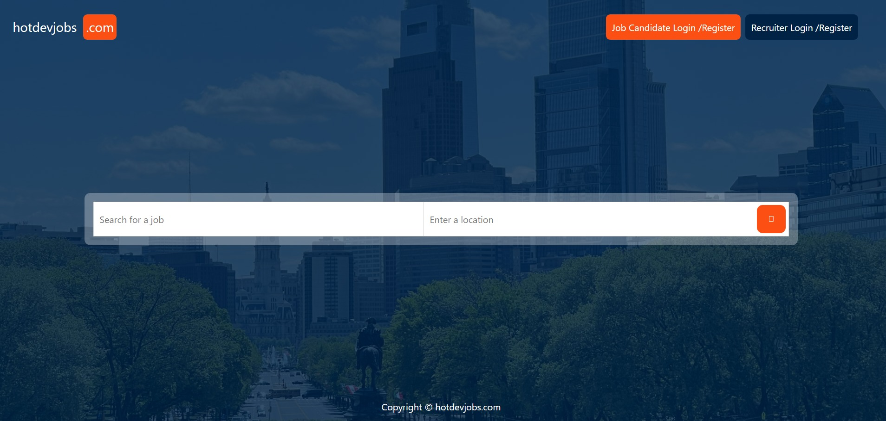
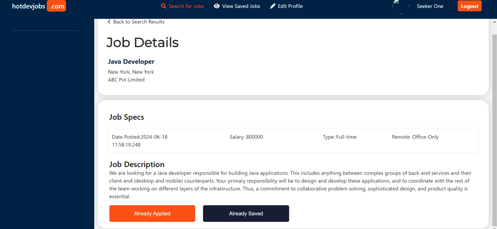
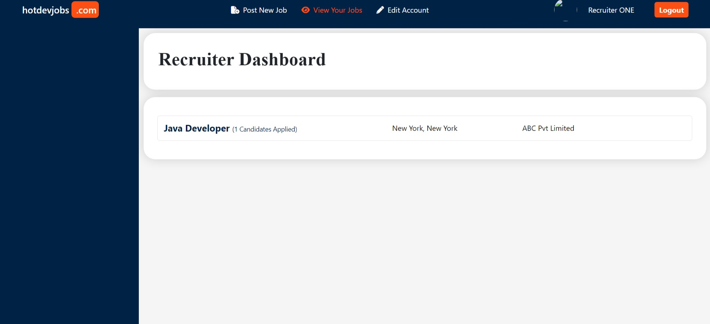
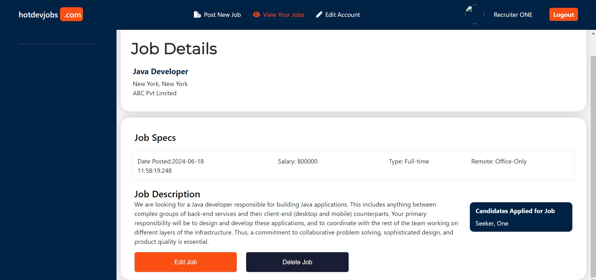

# Spring Boot 3

<h3>Créez un projet complet de bout en bout. Spring MVC, Thymeleaf, Spring Security, JPA, Hibernate et MySQL.</h3>

# Page d'accueil Portail d'emploi

# Page de connexion Candidats

# Page de connexion Recruiter

# Page de détails du poste des Candidats

# Page de Tableau de bord du recruteur

# Page de détails du poste des Candidats Vue Par le Recruteur

